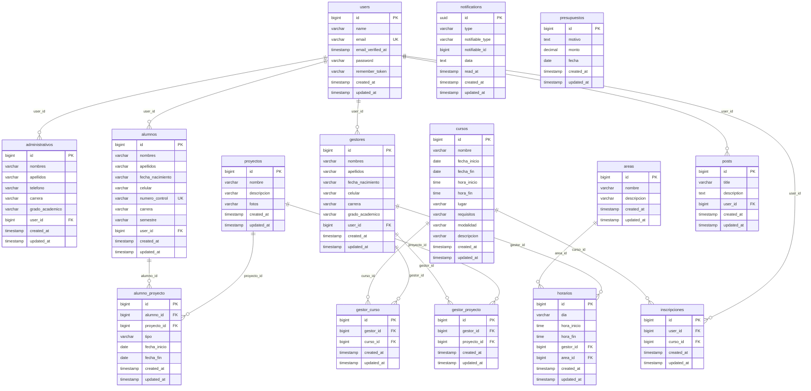
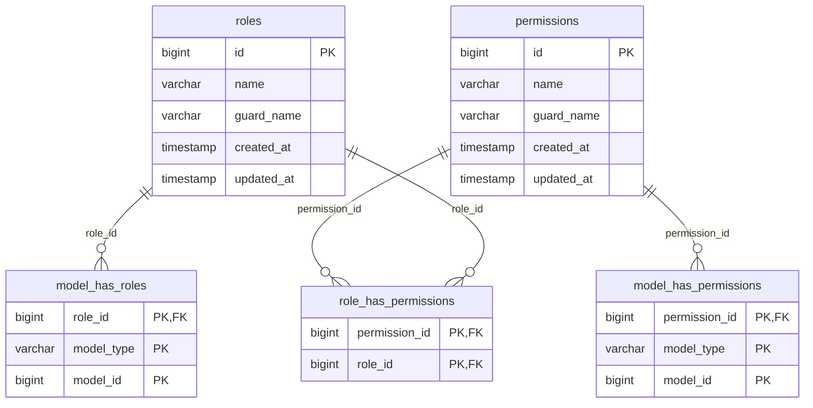

# Sistema NCIE — Diagrama y diccionario de la base de datos

> Generado a partir del esquema real de PostgreSQL 16 del entorno Docker (`docker compose exec db psql -U ncie ncie`) el 2026-09-11. Los conteos corresponden a los datos de demostración que siembra `DemoSeeder`.

**Motor:** PostgreSQL 16 (imagen `postgres:16-alpine`, collation `es-MX` vía ICU). **Tablas:** 25 (15 del dominio, 5 de Spatie Permission, 5 del framework). **Claves foráneas:** 18.

Las migraciones viven en `database/migrations/` y son portables (sin SQL crudo), por lo que el mismo esquema se crea con `php artisan migrate` en PostgreSQL o MySQL.

## 1. Diagrama entidad-relación (dominio)

Los nombres de las relaciones indican la columna que las materializa. `users` se especializa 1:1 en `administrativos`, `gestores` y `alumnos`; el área de un gestor se deduce de su `horario` de atención.



## 2. Roles y permisos (Spatie Permission)

Los permisos se llaman igual que las rutas (`admin.cursos.index`, `inscripciones.store`, …) y se asignan por rol en `database/seeders/RoleSeeder.php`. `model_has_roles` y `model_has_permissions` son polimórficas (`model_type` = `App\Models\User`).



## 3. Cómo se relacionan las entidades

| Relación | Cardinalidad | Tabla que la materializa | Notas |
|---|---|---|---|
| Usuario → perfil | 1 : 0..1 | `administrativos.user_id`, `gestores.user_id`, `alumnos.user_id` | Borrado en cascada: al eliminar el usuario se elimina el perfil, y los controladores eliminan el `User` al borrar el perfil. |
| Gestor → área | N : 1 (vía horario) | `horarios (gestor_id, area_id)` | Un gestor tiene un único horario de atención; ahí queda fijada su área. La landing lo consulta en `GET /areas/{id}`. |
| Gestor ↔ curso | N : N | `gestor_curso` | Asignación de quién imparte cada curso; se valida que no se solapen horarios de un mismo gestor. |
| Usuario ↔ curso | N : N | `inscripciones` (única por `user_id, curso_id`) | Cualquier usuario autenticado puede inscribirse; se valida cupo temporal y choques de horario. |
| Gestor ↔ proyecto | N : N | `gestor_proyecto` | Responsables de un proyecto. La landing muestra área y gestor de cada proyecto a partir de esta tabla. |
| Alumno ↔ proyecto | N : N | `alumno_proyecto` (`tipo` = residencias, servicio_social o propio) | Participación de alumnos con fechas de inicio y fin. |
| Usuario → aviso | 1 : N | `posts.user_id` | Autor del aviso. Cada aviso genera una fila en `notifications` por destinatario (según rol). |
| Presupuestos | — | `presupuestos` | Registro contable independiente, sin claves foráneas. |

## 4. Diccionario de datos

### Tablas del dominio

### `users`

Registros actuales (demo): **28**

| Columna | Tipo | Nulo | Clave / Referencia |
|---|---|---|---|
| `id` | bigint | no | PK |
| `name` | varchar(255) | no |  |
| `email` | varchar(255) | no | UNIQUE |
| `email_verified_at` | timestamp | sí |  |
| `password` | varchar(255) | no |  |
| `remember_token` | varchar(100) | sí |  |
| `created_at` | timestamp | sí |  |
| `updated_at` | timestamp | sí |  |

### `administrativos`

Registros actuales (demo): **3**

| Columna | Tipo | Nulo | Clave / Referencia |
|---|---|---|---|
| `id` | bigint | no | PK |
| `nombres` | varchar(100) | no |  |
| `apellidos` | varchar(100) | no |  |
| `telefono` | varchar(100) | no |  |
| `carrera` | varchar(255) | no |  |
| `grado_academico` | varchar(255) | no |  |
| `user_id` | bigint | no | FK → `users.id` (on delete cascade) |
| `created_at` | timestamp | sí |  |
| `updated_at` | timestamp | sí |  |

### `gestores`

Registros actuales (demo): **7**

| Columna | Tipo | Nulo | Clave / Referencia |
|---|---|---|---|
| `id` | bigint | no | PK |
| `nombres` | varchar(100) | no |  |
| `apellidos` | varchar(100) | no |  |
| `fecha_nacimiento` | varchar(255) | no |  |
| `celular` | varchar(10) | no |  |
| `carrera` | varchar(255) | no |  |
| `grado_academico` | varchar(255) | no |  |
| `user_id` | bigint | no | FK → `users.id` (on delete cascade) |
| `created_at` | timestamp | sí |  |
| `updated_at` | timestamp | sí |  |

### `alumnos`

Registros actuales (demo): **12**

| Columna | Tipo | Nulo | Clave / Referencia |
|---|---|---|---|
| `id` | bigint | no | PK |
| `nombres` | varchar(100) | no |  |
| `apellidos` | varchar(100) | no |  |
| `fecha_nacimiento` | varchar(100) | no |  |
| `celular` | varchar(100) | no |  |
| `numero_control` | varchar(100) | no | UNIQUE |
| `carrera` | varchar(100) | no |  |
| `semestre` | varchar(100) | no |  |
| `user_id` | bigint | no | FK → `users.id` (on delete cascade) |
| `created_at` | timestamp | sí |  |
| `updated_at` | timestamp | sí |  |

### `areas`

Registros actuales (demo): **7**

| Columna | Tipo | Nulo | Clave / Referencia |
|---|---|---|---|
| `id` | bigint | no | PK |
| `nombre` | varchar(100) | no |  |
| `descripcion` | varchar(500) | no |  |
| `created_at` | timestamp | sí |  |
| `updated_at` | timestamp | sí |  |

### `horarios`

Registros actuales (demo): **7**

| Columna | Tipo | Nulo | Clave / Referencia |
|---|---|---|---|
| `id` | bigint | no | PK |
| `dia` | varchar(255) | no |  |
| `hora_inicio` | time | no |  |
| `hora_fin` | time | no |  |
| `gestor_id` | bigint | no | FK → `gestores.id` (on delete cascade) |
| `area_id` | bigint | no | FK → `areas.id` (on delete cascade) |
| `created_at` | timestamp | sí |  |
| `updated_at` | timestamp | sí |  |

### `cursos`

Registros actuales (demo): **10**

| Columna | Tipo | Nulo | Clave / Referencia |
|---|---|---|---|
| `id` | bigint | no | PK |
| `nombre` | varchar(255) | no |  |
| `fecha_inicio` | date | no |  |
| `fecha_fin` | date | no |  |
| `hora_inicio` | time | no |  |
| `hora_fin` | time | no |  |
| `lugar` | varchar(100) | no |  |
| `requisitos` | varchar(255) | sí |  |
| `modalidad` | varchar(255) | no |  |
| `descripcion` | varchar(255) | sí |  |
| `created_at` | timestamp | sí |  |
| `updated_at` | timestamp | sí |  |

### `gestor_curso`

Registros actuales (demo): **12**

| Columna | Tipo | Nulo | Clave / Referencia |
|---|---|---|---|
| `id` | bigint | no | PK |
| `gestor_id` | bigint | no | FK → `gestores.id` (on delete cascade) |
| `curso_id` | bigint | no | FK → `cursos.id` (on delete cascade) |
| `created_at` | timestamp | sí |  |
| `updated_at` | timestamp | sí |  |

### `inscripciones`

Registros actuales (demo): **50**

| Columna | Tipo | Nulo | Clave / Referencia |
|---|---|---|---|
| `id` | bigint | no | PK |
| `user_id` | bigint | no | FK → `users.id` (on delete cascade) |
| `curso_id` | bigint | no | FK → `cursos.id` (on delete cascade) |
| `created_at` | timestamp | sí |  |
| `updated_at` | timestamp | sí |  |

Índice único compuesto: `user_id,curso_id`.

### `proyectos`

Registros actuales (demo): **8**

| Columna | Tipo | Nulo | Clave / Referencia |
|---|---|---|---|
| `id` | bigint | no | PK |
| `nombre` | varchar(300) | no |  |
| `descripcion` | varchar(400) | no |  |
| `fotos` | varchar(255) | sí |  |
| `created_at` | timestamp | sí |  |
| `updated_at` | timestamp | sí |  |

### `gestor_proyecto`

Registros actuales (demo): **12**

| Columna | Tipo | Nulo | Clave / Referencia |
|---|---|---|---|
| `id` | bigint | no | PK |
| `gestor_id` | bigint | no | FK → `gestores.id` (on delete cascade) |
| `proyecto_id` | bigint | no | FK → `proyectos.id` (on delete cascade) |
| `created_at` | timestamp | sí |  |
| `updated_at` | timestamp | sí |  |

### `alumno_proyecto`

Registros actuales (demo): **14**

| Columna | Tipo | Nulo | Clave / Referencia |
|---|---|---|---|
| `id` | bigint | no | PK |
| `alumno_id` | bigint | no | FK → `alumnos.id` (on delete cascade) |
| `proyecto_id` | bigint | no | FK → `proyectos.id` (on delete cascade) |
| `tipo` | varchar(255) | no |  |
| `fecha_inicio` | date | sí |  |
| `fecha_fin` | date | sí |  |
| `created_at` | timestamp | sí |  |
| `updated_at` | timestamp | sí |  |

### `posts`

Registros actuales (demo): **4**

| Columna | Tipo | Nulo | Clave / Referencia |
|---|---|---|---|
| `id` | bigint | no | PK |
| `title` | varchar(255) | no |  |
| `description` | text | no |  |
| `user_id` | bigint | no | FK → `users.id` (on delete no action) |
| `created_at` | timestamp | sí |  |
| `updated_at` | timestamp | sí |  |

### `notifications`

Registros actuales (demo): **70**

| Columna | Tipo | Nulo | Clave / Referencia |
|---|---|---|---|
| `id` | uuid | no | PK |
| `type` | varchar(255) | no |  |
| `notifiable_type` | varchar(255) | no |  |
| `notifiable_id` | bigint | no |  |
| `data` | text | no |  |
| `read_at` | timestamp | sí |  |
| `created_at` | timestamp | sí |  |
| `updated_at` | timestamp | sí |  |

### `presupuestos`

Registros actuales (demo): **10**

| Columna | Tipo | Nulo | Clave / Referencia |
|---|---|---|---|
| `id` | bigint | no | PK |
| `motivo` | text | no |  |
| `monto` | decimal | no |  |
| `fecha` | date | no |  |
| `created_at` | timestamp | sí |  |
| `updated_at` | timestamp | sí |  |

### Tablas de roles y permisos

### `roles`

Registros actuales (demo): **5**

| Columna | Tipo | Nulo | Clave / Referencia |
|---|---|---|---|
| `id` | bigint | no | PK |
| `name` | varchar(255) | no |  |
| `guard_name` | varchar(255) | no |  |
| `created_at` | timestamp | sí |  |
| `updated_at` | timestamp | sí |  |

Índice único compuesto: `name,guard_name`.

### `permissions`

Registros actuales (demo): **105**

| Columna | Tipo | Nulo | Clave / Referencia |
|---|---|---|---|
| `id` | bigint | no | PK |
| `name` | varchar(255) | no |  |
| `guard_name` | varchar(255) | no |  |
| `created_at` | timestamp | sí |  |
| `updated_at` | timestamp | sí |  |

Índice único compuesto: `name,guard_name`.

### `model_has_roles`

Registros actuales (demo): **34**

| Columna | Tipo | Nulo | Clave / Referencia |
|---|---|---|---|
| `role_id` | bigint | no | PK, FK → `roles.id` (on delete cascade) |
| `model_type` | varchar(255) | no | PK |
| `model_id` | bigint | no | PK |

### `model_has_permissions`

Registros actuales (demo): **0**

| Columna | Tipo | Nulo | Clave / Referencia |
|---|---|---|---|
| `permission_id` | bigint | no | PK, FK → `permissions.id` (on delete cascade) |
| `model_type` | varchar(255) | no | PK |
| `model_id` | bigint | no | PK |

### `role_has_permissions`

Registros actuales (demo): **190**

| Columna | Tipo | Nulo | Clave / Referencia |
|---|---|---|---|
| `permission_id` | bigint | no | PK, FK → `permissions.id` (on delete cascade) |
| `role_id` | bigint | no | PK, FK → `roles.id` (on delete cascade) |

### Tablas del framework

### `migrations`

Registros actuales (demo): **20**

| Columna | Tipo | Nulo | Clave / Referencia |
|---|---|---|---|
| `id` | int | no | PK |
| `migration` | varchar(255) | no |  |
| `batch` | int | no |  |

### `password_reset_tokens`

Registros actuales (demo): **0**

| Columna | Tipo | Nulo | Clave / Referencia |
|---|---|---|---|
| `email` | varchar(255) | no | PK |
| `token` | varchar(255) | no |  |
| `created_at` | timestamp | sí |  |

### `password_resets`

Registros actuales (demo): **0**

| Columna | Tipo | Nulo | Clave / Referencia |
|---|---|---|---|
| `email` | varchar(255) | no |  |
| `token` | varchar(255) | no |  |
| `created_at` | timestamp | sí |  |

### `failed_jobs`

Registros actuales (demo): **0**

| Columna | Tipo | Nulo | Clave / Referencia |
|---|---|---|---|
| `id` | bigint | no | PK |
| `uuid` | varchar(255) | no | UNIQUE |
| `connection` | text | no |  |
| `queue` | text | no |  |
| `payload` | text | no |  |
| `exception` | text | no |  |
| `failed_at` | timestamp | no |  |

### `personal_access_tokens`

Registros actuales (demo): **0**

| Columna | Tipo | Nulo | Clave / Referencia |
|---|---|---|---|
| `id` | bigint | no | PK |
| `tokenable_type` | varchar(255) | no |  |
| `tokenable_id` | bigint | no |  |
| `name` | varchar(255) | no |  |
| `token` | varchar(64) | no | UNIQUE |
| `abilities` | text | sí |  |
| `last_used_at` | timestamp | sí |  |
| `expires_at` | timestamp | sí |  |
| `created_at` | timestamp | sí |  |
| `updated_at` | timestamp | sí |  |

## 5. Restricciones y observaciones

- Restricción CHECK vigente: `CHECK (((tipo)::text = ANY ((ARRAY['residencias'::character varying, 'servicio_social'::character varying, 'propio'::character varying])::text[])))` en `alumno_proyecto.tipo` (Laravel traduce el `enum` de la migración a `varchar` + CHECK en PostgreSQL).

- `fecha_nacimiento` en `alumnos` y `gestores` es `varchar`, no `date`. Funciona, pero cualquier comparación por fecha debería convertir el valor primero. Cambiarla a `date` está pendiente.

- `password_resets` es una tabla heredada de Laravel 8; Laravel 10 usa `password_reset_tokens`. Ambas existen porque la migración antigua sigue en el repositorio.

- Los correos se comparan de forma sensible a mayúsculas en PostgreSQL. El registro y el login normalizan poco, así que conviene guardar los correos en minúsculas.

- `notifications.data` es JSON con `title` y `description`; `read_at` en `NULL` significa no leída.

- `proyectos.fotos` guarda la ruta relativa dentro de `public/` (por ejemplo `uploads/fotos/proyecto-1.jpg`). `DemoSeeder` copia las imágenes de demostración desde `public/assets/img/gallery`.


## 6. Comandos útiles

```bash
# Consola SQL
docker compose exec db psql -U ncie ncie

# Esquema y datos desde cero
docker compose exec app php artisan migrate:fresh --seed
docker compose exec app php artisan db:seed --class=DemoSeeder

# Respaldo y restauración
docker compose exec db pg_dump -U ncie ncie > respaldo.sql
docker compose exec -T db psql -U ncie ncie < respaldo.sql
```
